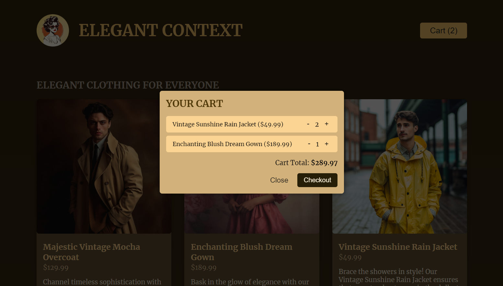

# 쇼핑몰 프로젝트 (학습용 프로젝트)
- context API와 useReducer를 이용한 전역 상태 관리를 학습하며, 쇼핑몰을 구현해보았다.
- 모달창을 띄울 수 있도록 useRef, useImperativeHandle 등의 훅을 이용해보고, 공부하였다.

### 홈 화면
;
- 프로젝트 실행 시 보이는 첫 화면으로 품목 별 add버튼이 있는데, 누르게 되면 품목의 수량이 카트에 더해져 총 계산 금액을 알려준다.

### 카트 화면
;